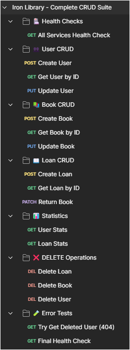

# 🧪 Iron Library - Colección de Postman

> Suite completa de tests para validar todos los endpoints de los microservicios Iron Library

## 📋 Descripción

Esta colección de Postman contiene tests automatizados para verificar el funcionamiento completo de la arquitectura de microservicios Iron Library, incluyendo operaciones CRUD, validaciones de negocio y comunicación entre servicios.

## 🎯 Cobertura de Tests

### **✅ Servicios Incluidos**
- **User Service** (Puerto 8082) - Gestión de usuarios y membresías
- **Book Service** (Puerto 8081) - Catálogo de libros e inventario  
- **Loan Service** (Puerto 8083) - Operaciones de préstamos
- **Gateway Service** (Puerto 8087) - Punto de entrada único

### **✅ Operaciones Testadas**
- **CREATE** - Creación de entidades con validaciones
- **READ** - Consultas por ID, filtros y búsquedas
- **UPDATE** - Actualizaciones completas (PUT) y parciales (PATCH)
- **DELETE** - Eliminación con verificaciones

### **✅ Casos de Prueba**
- ✅ **Health Checks** - Verificación de servicios activos
- ✅ **CRUD Completo** - Todas las operaciones en cada servicio
- ✅ **Búsquedas y Filtros** - Por categoría, membresía, estado
- ✅ **Estadísticas** - Reportes y métricas
- ✅ **Error Handling** - Validación de errores 404, 409, 400
- ✅ **Integration Flow** - Flujo completo Usuario → Libro → Préstamo
- ✅ **Data Cleanup** - Limpieza automática de datos de prueba

## 🚀 Cómo Usar la Colección

### **1. Prerrequisitos**
- Postman instalado
- Todos los microservicios ejecutándose:
  - Discovery Server (8761)
  - Gateway Service (8087)
  - User Service (8082)
  - Book Service (8081)
  - Loan Service (8083)

### **2. Importar la Colección**
```bash
# Opción A: Importar desde archivo
1. Descargar: iron-library-complete-crud.json
2. Abrir Postman
3. Click "Import" → "Upload Files"
4. Seleccionar el archivo descargado

# Opción B: Importar desde URL
1. Abrir Postman
2. Click "Import" → "Link"
3. Pegar: https://raw.githubusercontent.com/IronLibray/postman-collection/main/iron-library-complete-crud.json
```

### **3. Configurar Variables**
La colección incluye variables preconfiguradas:
```json
{
  "gateway_url": "http://localhost:8087",
  "test_user_id": "(generado automáticamente)",
  "test_book_id": "(generado automáticamente)", 
  "test_loan_id": "(generado automáticamente)",
  "timestamp": "(generado automáticamente)"
}
```

### **4. Ejecutar Tests**

#### **Opción A: Ejecutar colección completa**
```bash
1. Click derecho en "Iron Library - Complete CRUD Suite"
2. Seleccionar "Run collection"
3. Configurar:
   - Delay: 200ms (recomendado)
   - Iterations: 1
   - Keep variable values: ✅
4. Click "Run Iron Library..."
```

#### **Opción B: Ejecutar tests individuales**
```bash
1. Expandir carpetas de la colección
2. Click en test específico
3. Click "Send"
4. Verificar respuesta y tests
```

## 📊 Resultados Esperados

### **Métricas de Éxito**
- **✅ Tests Passed**: ~25+ tests
- **✅ Requests**: ~20+ peticiones
- **✅ Success Rate**: 100%
- **✅ Duration**: ~8-12 segundos (con delays)

### **Estructura de Tests**
```
🏥 Health Checks (1 test)
👥 User CRUD (3 tests)
📚 Book CRUD (3 tests)  
📖 Loan CRUD (3 tests)
📊 Statistics (2 tests)
❌ DELETE Operations (3 tests)
🧪 Error Tests (2 tests)
```

## 🎯 Casos de Uso Cubiertos

### **Flujo de Integración Completa**
1. **Verificar servicios** activos
2. **Crear usuario** con membresía Premium
3. **Crear libro** con inventario disponible
4. **Crear préstamo** vinculando usuario y libro
5. **Actualizar datos** (PUT/PATCH operations)
6. **Devolver libro** (actualiza inventario)
7. **Eliminar registros** (orden: préstamo → libro → usuario)
8. **Verificar eliminación** (validar 404s)

### **Validaciones de Negocio**
- ✅ **Usuarios duplicados** - Email único
- ✅ **Libros duplicados** - ISBN único
- ✅ **Límites de préstamo** - Por tipo de membresía
- ✅ **Disponibilidad** - Stock de libros
- ✅ **Estados de préstamo** - Activo/Devuelto/Vencido

## 🔧 Personalización

### **Modificar Variables**
```javascript
// En Pre-request Scripts
pm.collectionVariables.set('gateway_url', 'http://localhost:8080');
```

### **Agregar Tests Personalizados**
```javascript
// En Tests tab
pm.test("Mi test personalizado", function () {
    pm.response.to.have.status(200);
    const response = pm.response.json();
    pm.expect(response.campo).to.eql("valor_esperado");
});
```

## 📈 Screenshots

### Ejecución Completa


### Vista de Colección


## 🐛 Troubleshooting

### **Tests Fallan**
```bash
1. Verificar que todos los servicios estén ejecutándose
2. Comprobar URLs y puertos en variables
3. Revisar logs de servicios para errores
4. Aumentar delay entre requests si es necesario
```

### **Errores Comunes**
- **404 Not Found**: Servicio no ejecutándose o URL incorrecta
- **Connection Refused**: Puerto incorrecto o servicio caído
- **409 Conflict**: Datos duplicados de ejecución anterior

## 📚 Archivos en este Repositorio

- `iron-library-complete-crud.json` - Colección principal con todos los tests
- `screenshots/` - Capturas de pantalla de resultados
- `README.md` - Esta documentación

## 🔗 Enlaces Relacionados

- [Iron Library Organization](https://github.com/IronLibray)
- [User Service](https://github.com/IronLibray/user-service)
- [Book Service](https://github.com/IronLibray/book-service)
- [Loan Service](https://github.com/IronLibray/loan-service)
- [Gateway Service](https://github.com/IronLibray/gateway-service)
- [Discovery Server](https://github.com/IronLibray/discovery-server)

## 🤝 Contribución

Para agregar nuevos tests o mejorar los existentes:

1. Fork este repositorio
2. Modificar la colección en Postman
3. Exportar y reemplazar el archivo JSON
4. Actualizar documentación si es necesario
5. Crear Pull Request

## 📄 Licencia

Este proyecto está bajo la Licencia MIT - ver el archivo [LICENSE](LICENSE) para detalles.

---

**🧪 Suite de Testing para Iron Library Microservices**  
**📚 Validación completa de arquitectura distribuida**
